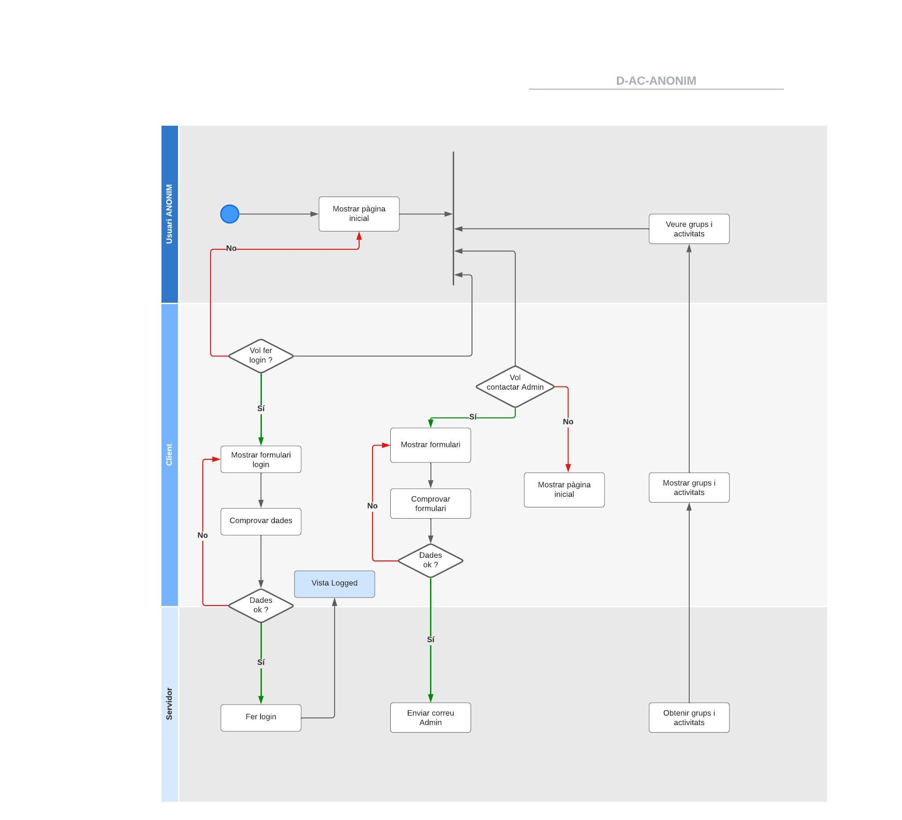
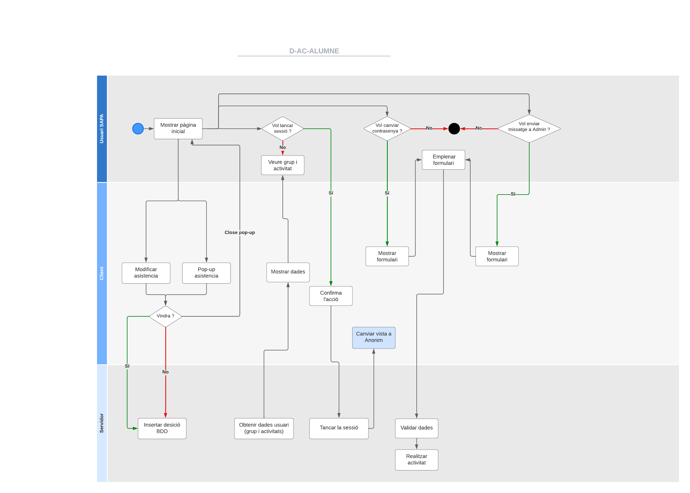
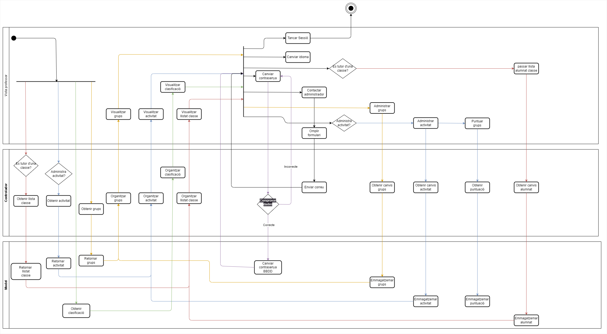
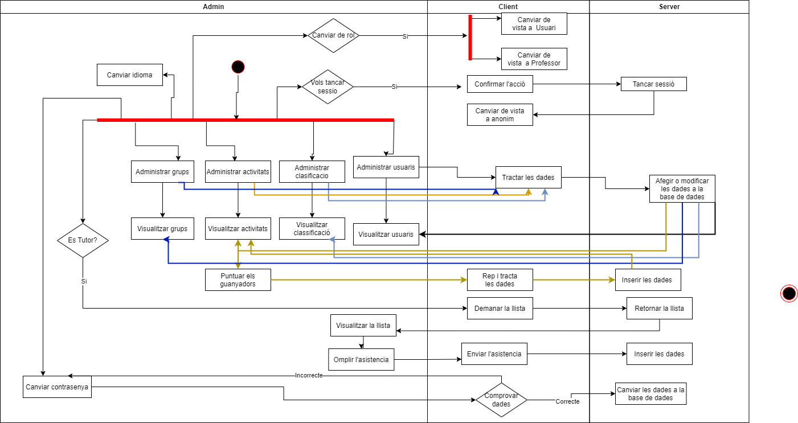

# DIAGRAMES

- D-AC - Diagrames d'activitat
- D-CU - Diagrames de casos d'ús
- D-CL - Diagrames de classes

## DIAGRAMES D'ACTIVITATS

En aquest apartat es troben els diagrames d'activitat de cada un dels actors del sistema. Aquests diagrames són els següents:

- Anonim
- Alumne
- Professor
- Administrador

### DIAGRAMA ANONIM

### DIAGRAMA ALUMNE

### DIAGRAMA PROFESSOR

### DIAGRAMA ADMINISTRADOR

