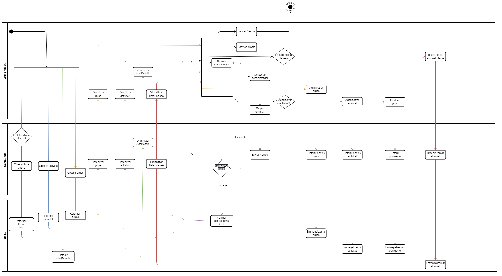
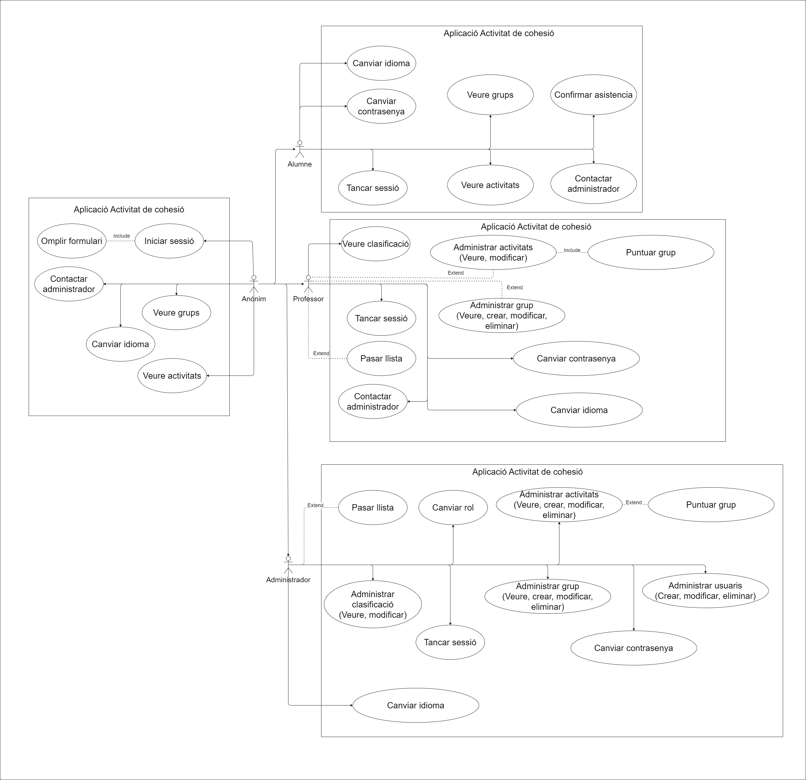

# DIAGRAMES

- D-AC - Diagrames d'activitat
- D-CU - Diagrames de casos d'ús
- D-CL - Diagrames de classes

## DIAGRAMES D'ACTIVITATS

En aquest apartat es troben els diagrames d'activitat de cada un dels actors del sistema. Aquests diagrames són els següents:

- Anonim
- Alumne
- Professor
- Administrador

### DIAGRAMA ANONIM

### DIAGRAMA ALUMNE

### DIAGRAMA PROFESSOR

### DIAGRAMA ADMINISTRADOR

## DIAGRAMES DE CASOS D'ÚS

En aquest apartat es troben els diagrames de casos d'ús de cada un dels actors del sistema. En aquest cas, només hi ha un diagrama de casos d'ús per a tots els actors del sistema. Aquest diagrama és el següent:

## DIAGRAMES DE CLASSES

